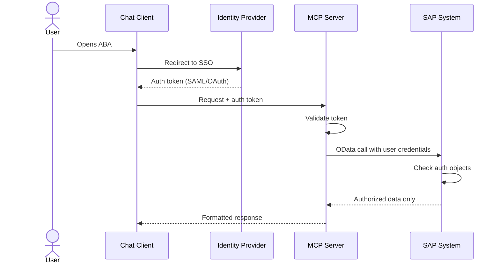

# Authentication & Security

Security is a foundational principle of ABA. Every interaction respects SAP's authorization model.

## Authentication Flow

## Supported Authentication Methods

| Method | Description | Recommended For |
|--------|-------------|----------------|
| **SAML 2.0 / SSO** | Enterprise single sign-on | Production environments |
| **OAuth 2.0** | Token-based authentication | API integrations |
| **Basic Auth** | Username/password | Development & testing only |
| **X.509 Certificates** | Certificate-based | High-security environments |

## Security Principles

### 1. User-Level Authorization

!!! success "No Shared Service Accounts"
    Every SAP call is made with the **authenticated user's credentials**. ABA never uses a technical service account to read business data.

This means:

- A finance user sees only their authorized company codes
- A procurement user sees only their purchasing organizations
- A plant manager sees only their assigned plants
- Nobody sees more through ABA than they would through SAP GUI

### 2. No Data Persistence

!!! success "No SAP Data Stored Outside SAP"
    ABA queries SAP in real-time. Business data is never cached, stored, or logged on the ABA side.

The only data stored is:

- Conversation logs (if enabled) — containing the natural language interaction only
- User session tokens — temporary, for authentication purposes

### 3. Audit Trail

All ABA interactions can be traced:

- **ABA side:** Conversation logs with timestamps and user IDs
- **SAP side:** Standard SAP audit logs capture all OData calls
- **Correlation:** Each request carries a correlation ID for end-to-end tracing

### 4. Network Security

| Control | Implementation |
|---------|---------------|
| **Encryption in transit** | TLS 1.2+ for all communications |
| **Network segmentation** | MCP Server in DMZ or internal network |
| **Firewall rules** | Only required OData ports open to SAP |
| **Rate limiting** | Configurable per user and per tool |

## Data Flow Summary

!!! note "What goes where"
    | Data | Stored in ABA? | Stored in SAP? |
    |------|:--------------:|:--------------:|
    | User question (text) | Optional (logs) | No |
    | SAP business data | **Never** | Yes (source) |
    | User credentials | Session only | Yes (master) |
    | Conversation history | Optional | No |
    | AI model context | Memory only | No |
