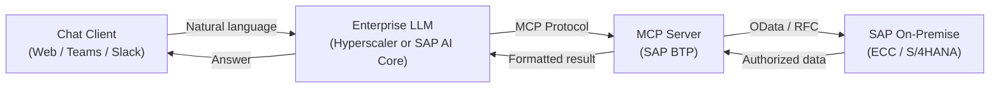

# Deployment (Recommended Approach)

ABA is designed for **SAP on-premise landscapes** (ECC / S/4HANA on-premise). The standard deployment pattern places the **MCP Server layer on SAP BTP**, keeping SAP data access governed by SAP identity and authorizations.

## Reference Architecture

!!! info "Notes"
    - The MCP Server layer is typically deployed on **SAP BTP** to simplify connectivity, identity, and governance.
    - LLM access is provided via **trusted hyperscalers** or **SAP AI Core**.
    - Response times depend on SAP load, network latency, and the number of sequential tool calls.

## Infrastructure Requirements (MCP Server)

| Resource | Minimum | Recommended |
|----------|---------|-------------|
| CPU | 2 cores | 4 cores |
| RAM | 4 GB | 8 GB |
| Storage | 10 GB | 20 GB |
| Runtime | Node.js 18+ | Node.js 20 LTS |

!!! warning "Scope"
    This documentation does not cover SAP S/4HANA public or private cloud deployments. ABA is positioned for **on-premise** scenarios.
