# MCP Server Layer

The MCP (Model Context Protocol) Server is the core component of ABA. It acts as the bridge between the AI model and your SAP system.

## What is MCP?

The **Model Context Protocol** is an open standard that defines how AI models discover and use external tools. Think of it as a "plugin system" for AI — the model knows what tools are available, what they do, and how to call them.

## How ABA Uses MCP

Each SAP capability is exposed as an **MCP tool**. When a user asks a question, the AI model:

1. Analyzes the user's intent
2. Selects the appropriate tool(s) from the available set
3. Calls the tool with the right parameters
4. Receives structured data back
5. Formats it into a conversational response

!!! example "Example: Tool Selection"
    **User:** *"Show me open invoices from Siemens"*
    
    **AI reasoning:** User wants open AP items filtered by vendor name → use `fi_get_open_items` tool
    
    **Tool call:** `fi_get_open_items(vendor_name="Siemens", item_status="open")`
    
    **Tool response:** Structured data with invoice numbers, amounts, dates
    
    **AI response:** *"I found 3 open invoices from Siemens AG totaling €127,450..."*

## Tool Architecture

```mermaid
flowchart LR
    subgraph Tools["MCP Tools"]
        direction TB
        T1["fi_get_open_items"]
        T2["fi_get_document"]
        T3["fi_get_balance"]
        T4["mm_get_purchase_orders"]
        T5["mm_get_material"]
        T6["sd_get_sales_orders"]
        T7["..."]
    end

    subgraph Handlers["Tool Handlers"]
        direction TB
        H1["Parameter validation"]
        H2["OData query builder"]
        H3["Response formatter"]
    end

    subgraph SAP["SAP OData"]
        direction TB
        S1["API_OPEN_ITEMS_SRV"]
        S2["API_FINANCIALDOCUMENT_SRV"]
        S3["API_PURCHASEORDER_SRV"]
        S4["..."]
    end

    Tools --> Handlers --> SAP
```



Each tool consists of:

- **Definition** — Name, description, and parameter schema (what the AI sees)
- **Handler** — Business logic that translates parameters into OData calls
- **Formatter** — Converts SAP response data into readable output

## Configuration

Tools are defined in a configuration file that maps each tool to its OData service:

```yaml
tools:
  fi_get_open_items:
    description: "Retrieve open AP/AR items filtered by vendor, customer, amount, age"
    odata_service: API_OPEN_ITEMS_SRV
    entity_set: OpenItems
    default_top: 50
    parameters:
      vendor_name:
        type: string
        description: "Vendor name (supports fuzzy matching)"
        maps_to: SupplierName
      min_amount:
        type: number
        description: "Minimum amount filter"
        maps_to: AmountInCompanyCodeCurrency
```

!!! tip "Extensibility"
    Adding a new tool is as simple as adding a new entry to this configuration and mapping it to an activated OData service. See [Adding OData Services](../integration/adding-odata-services.md).
