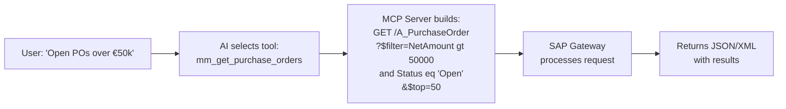

# OData Integration

ABA leverages SAP's standard **OData services** as its primary data access layer. This ensures clean, supported, and upgrade-safe integration.

## Why OData?

| Benefit | Description |
|---------|-------------|
| **Standard** | SAP's official REST API protocol |
| **Supported** | Maintained and updated by SAP with each release |
| **Upgrade-safe** | No custom ABAP — survives system upgrades |
| **Secure** | Inherits SAP's authorization model |
| **Documented** | Available on SAP API Business Hub |

## How ABA Builds OData Queries

When the AI selects a tool, the MCP Server constructs an OData request:

### Query Features Used

| OData Feature | Usage in ABA |
|---------------|-------------|
| `$filter` | Translating user criteria into data filters |
| `$select` | Requesting only needed fields for performance |
| `$expand` | Following navigation properties (e.g., PO → Items) |
| `$top` / `$skip` | Pagination for large result sets |
| `$orderby` | Sorting results as requested |
| `$count` | Getting totals for summary queries |

## Service Activation

Before ABA can use an OData service, it must be activated in your SAP system.

!!! info "Activation Steps"
    1. **Check availability:** Transaction `SEGW` or SAP API Business Hub
    2. **Activate in Gateway:** Transaction `/IWFND/MAINT_SERVICE`
    3. **Assign system alias:** Map to your backend system
    4. **Test:** Use `SAP Gateway Client` or browser to verify
    5. **Register in ABA:** Add the tool definition to MCP Server config

## Handling Non-OData Scenarios

For operations not covered by standard OData services, ABA can also use:

- **BAPIs** — Called via RFC, wrapped as OData through a custom Gateway service
- **CDS Views** — Exposed as OData services in S/4HANA
- **Custom OData (Z services)** — Organization-specific services

!!! warning "Recommendation"
    Always prefer standard SAP OData services over custom development. This keeps the integration upgrade-safe and reduces maintenance burden.
