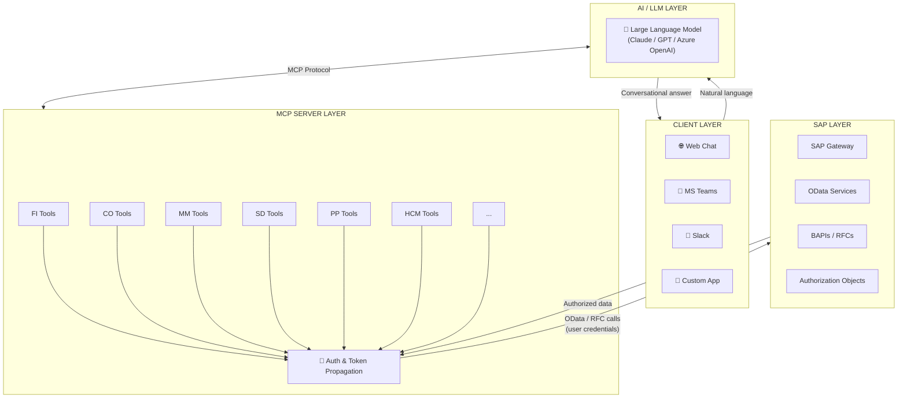
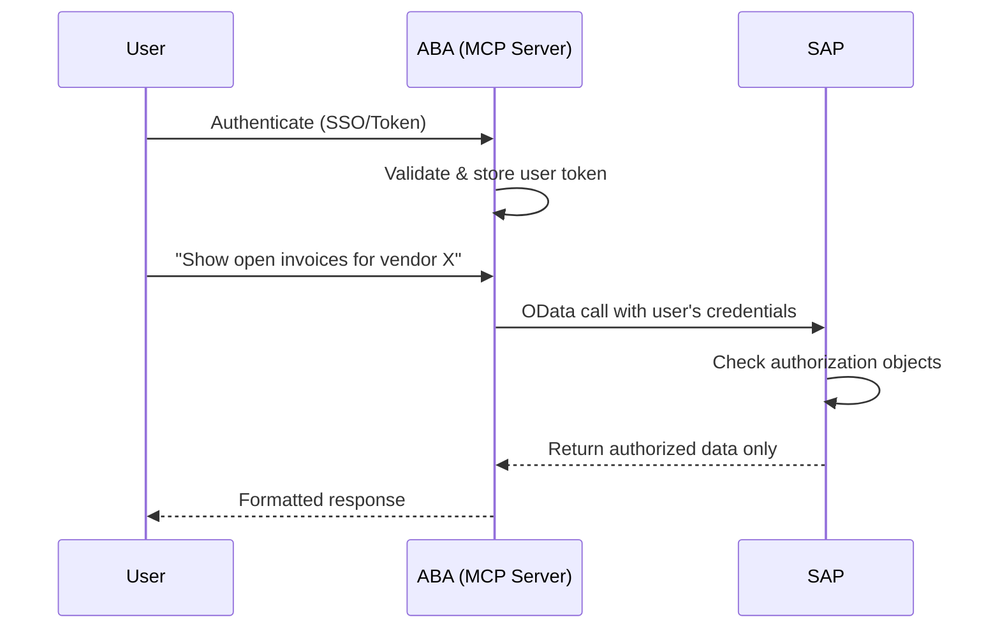

# System Architecture

## Overview

ABA follows a layered architecture built on the **Model Context Protocol (MCP)** standard. This ensures clean separation of concerns, extensibility, and security.

## Architecture Diagram

## Component Details

### Client Layer

The user-facing interface. ABA is **client-agnostic** — it can be embedded in:

| Client | Integration | Best For |
|--------|------------|----------|
| Web Chat | Standalone app | Dedicated ABA experience |
| Microsoft Teams | Bot Framework | Organizations already on Teams |
| Slack | Slack App | Tech-forward teams |
| Custom Apps | REST API | Embedding in existing portals |

### AI / LLM Layer

The intelligence layer that interprets user intent and orchestrates tool usage.

!!! info "Supported LLM Providers"
    | Provider | Example models | Notes |
    |----------|----------------|-------|
    | Anthropic | Claude Sonnet family | Recommended — strong tool use and reasoning |
    | OpenAI | Latest GPT models | Direct OpenAI API consumption when permitted by policy |
    | Azure OpenAI | Latest GPT models via Azure | For Azure-first customers and data residency needs |
    | SAP AI Core | SAP-managed models (incl. partner models such as Mistral) | For customers standardizing on SAP BTP and SAP AI Core |
    | Self-hosted | Llama, Mistral, others | For maximum data control in customer infrastructure |

The LLM communicates with the MCP Server using the **Model Context Protocol**, a standardized way for AI models to discover and use tools. In all cases, ABA connects only to **enterprise-grade hosting environments** (hyperscalers or SAP AI Core), ensuring that prompts and SAP data remain isolated and are not used to train public models.

### MCP Server Layer

The core of ABA. This layer:

- **Exposes SAP capabilities as MCP tools** that the LLM can invoke
- **Handles authentication** by propagating user credentials/tokens to SAP
- **Manages OData calls** to the SAP backend
- **Formats responses** for human-readable output
- **Enforces security** — never exposes data beyond user authorization

In a standard deployment, the MCP Server layer is hosted on **SAP BTP**, which simplifies connectivity, identity management, and governance alongside existing SAP services. In specific scenarios it can also be deployed in **customer cloud environments** (for example, Azure) while still integrating securely with SAP.

!!! tip "Modularity"
    Each SAP module has its own set of tools (e.g., `fi_get_open_items`, `mm_get_purchase_orders`). Modules can be enabled or disabled independently.

### SAP Layer

Your existing SAP system — no modifications required beyond activating OData services:

- **SAP Gateway / ICM** — Serves OData endpoints
- **Standard OData Services** — Activated per module
- **BAPIs and RFCs** — For operations not covered by OData
- **Authorization Objects** — Control data access per user

## Security Model

!!! warning "Security Principles"
    1. **No service accounts for data access** — All SAP calls use the authenticated user's credentials
    2. **SAP authorization respected** — If a user can't see cost center 2000 in SAP GUI, they can't see it through ABA
    3. **No data caching** — Queries run in real-time; no SAP data stored outside SAP
    4. **Audit trail** — All interactions logged for compliance
