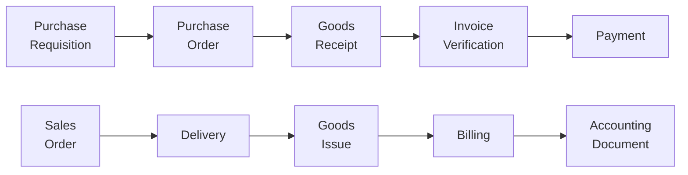

# Cross-Module Queries

One of ABA's most powerful features is the ability to follow data across SAP modules in a single conversation.

## Document Flow Navigation

SAP documents are connected across modules. ABA can traverse these relationships:

!!! example "Examples"
    - *"Show me the full document flow for purchase order 4500012345"*
    - *"Which invoice corresponds to goods receipt 5000067890?"*
    - *"Trace sales order 100234 from creation to payment"*

## Cross-Module Query Examples

| Query | Modules Involved |
|-------|-----------------|
| *"What's the total procurement cost for production order 60001234?"* | PP → MM → FI |
| *"Show vendor performance: delivery times vs. quality scores"* | MM → QM |
| *"Which sales orders have open maintenance issues on the delivered equipment?"* | SD → PM |
| *"Compare planned vs actual costs for internal order 800100"* | CO → FI |
| *"Materials with quality holds affecting open sales orders"* | QM → MM → SD |

## How It Works

ABA chains multiple MCP tool calls to gather data across modules:

1. User asks a cross-module question
2. AI identifies all relevant tools needed
3. Calls are executed sequentially, using results from one to query the next
4. Final response synthesizes data from all sources

!!! info "How It Works"
    Cross-module queries execute multiple SAP calls sequentially. As the AI processes your request, you can follow its reasoning as it identifies and queries each relevant module, providing transparency into the cross-module data gathering process.
