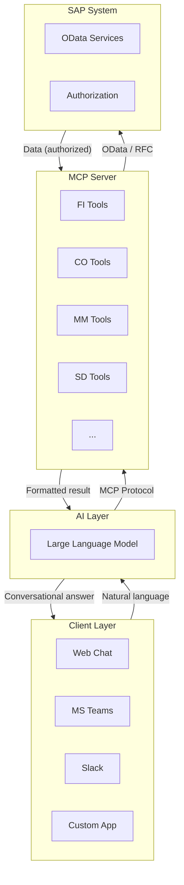

# Architecture Overview

ABA follows a clean layered architecture that keeps each component independent and replaceable.

For a detailed technical deep-dive, see [System Architecture](../architecture/system-architecture.md).

## High-Level Flow

## Core Principles

!!! info "Security First"
    All SAP calls use the authenticated user's credentials. ABA never uses a service account to access business data.

!!! info "Standards-Based"
    Built on SAP's standard OData services and the open MCP protocol. No proprietary lock-in.

!!! info "Modular"
    Each SAP module is implemented as independent MCP tools. Enable only what you need.

!!! info "LLM-Agnostic"
    Works with Claude, Gemini, Azure OpenAI, or self-hosted models. Switch providers without changing the integration.

!!! info "Enterprise-Grade Privacy"
    ABA only connects to models hosted by **trusted hyperscalers** (such as Microsoft Azure, Google Cloud Platform, or AWS) or via **SAP AI Core** when applicable. When using these providers, your prompts and SAP data are processed securely and remain **logically isolated**: your data is not used to train public models nor exposed to other customers.
