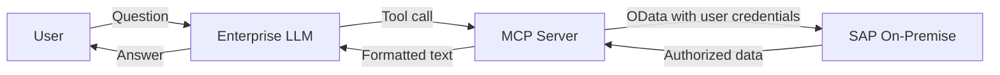

# Security and Compliance

A high-level overview of how ABA handles data privacy, access control, and compliance — designed for decision-makers evaluating the solution.

---

## Where Does My Data Go?

- **SAP data never leaves your landscape in raw form.** The MCP Server queries SAP via OData using the authenticated user's credentials and returns only formatted, filtered results.
- **The LLM receives structured text**, not database dumps or table exports.
- **No SAP data is cached, stored, or persisted** outside of SAP. Queries run in real time.

---

## Are My Data Used to Train AI Models?

**No.** ABA connects only to enterprise-grade LLM hosting:

- **Trusted hyperscalers** (Anthropic, OpenAI via Azure, Google Cloud, AWS)
- **SAP AI Core** (SAP-managed models on BTP)

In all cases:

- Your prompts and data are processed in **logically isolated environments**.
- Data is **not used to train, fine-tune, or improve** public or third-party models.
- Encryption in transit (TLS 1.2+) is enforced on every connection.

---

## Who Can Access What?

ABA enforces the **same authorization model as SAP GUI**:

!!! info "Key principle"
    If a user cannot see data in SAP GUI, they cannot see it through ABA. There are no shortcuts, no service accounts for data access, and no privilege escalation.

- Every query runs with the **authenticated user's SAP credentials**.
- SAP **authorization objects** control access at the field, document, and organizational level.
- ABA does not introduce new access paths — it uses SAP's standard OData layer.

---

## Compliance Considerations

| Concern | How ABA addresses it |
|---------|---------------------|
| **GDPR / Data Privacy** | No personal data stored outside SAP; no data replication; user consent follows existing SAP processes |
| **SOX / Financial Controls** | All financial queries respect SAP authorization; no bypass of segregation of duties; write operations follow approval workflows |
| **Audit Trail** | All ABA interactions can be logged (natural language queries and tool calls); SAP-side changes leave standard SAP change documents |
| **Data Residency** | SAP data stays on-premise; LLM processing region is configurable per hyperscaler or SAP AI Core |

---

## What Happens If the LLM Is Unavailable?

ABA is a **complementary access layer**, not a critical system:

- If the LLM or MCP Server is temporarily unavailable, **SAP continues to operate normally**.
- Users can always fall back to SAP GUI or Fiori.
- No SAP process, workflow, or batch job depends on ABA being online.

---

## What Happens During SAP Upgrades or Note Application?

- ABA uses **SAP's standard OData services**, which are maintained by SAP as part of the platform.
- Applying support packages or notes does not typically affect OData service availability.
- If a service is changed or deprecated by SAP, the MCP tool layer is updated accordingly — no ABAP changes required in your system.

---

## Summary

| Question | Answer |
|----------|--------|
| Does ABA store my SAP data? | No. Real-time queries only. |
| Can ABA access data the user shouldn't see? | No. SAP authorizations are enforced. |
| Are my data used to train AI models? | No. Enterprise-grade, isolated hosting only. |
| Does ABA modify my SAP system? | No code changes. Only standard OData activation. |
| Is ABA a critical dependency? | No. SAP operates independently. |
