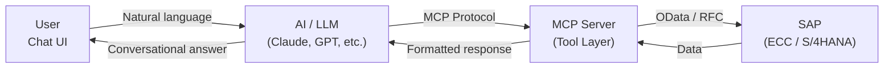

# ABA — Avvale Business Assistant

  <strong style="font-size: 1.3em; color: var(--md-primary-fg-color);">Conversational AI for SAP On-Premise environments</strong>
    
  <em>Bringing natural language interaction to your existing SAP ECC and S/4HANA systems.</em>

---

## What is ABA?

**ABA (Avvale Business Assistant)** enables natural language interaction with your SAP on-premise systems. Built on the **Model Context Protocol (MCP)** architecture, it allows business users to query, analyze, and interact with SAP data using conversational language — without requiring SAP GUI expertise.

-   :material-chat-processing:{ .lg .middle } __Natural Language Access__

    ---

    Ask questions in plain language:  
    *"Show me all open purchase orders over €50,000"*

-   :material-view-module:{ .lg .middle } __Multi-Module Coverage__

    ---

    Works across FI, CO, MM, SD, PP, HCM, PM, QM, and WM modules

-   :material-server:{ .lg .middle } __On-Premise Focus__

    ---

    Specifically designed for organizations running SAP ECC or S/4HANA on-premise

-   :material-shield-check:{ .lg .middle } __Enterprise Security__

    ---

    Respects SAP authorization model — users only see data they're permitted to access

-   :material-api:{ .lg .middle } __OData-Powered__

    ---

    Leverages SAP's standard OData services for clean, supported integration

-   :material-puzzle:{ .lg .middle } __Extensible__

    ---

    Add new OData services and modules as your needs grow

## How It Works

1. The user asks a question in natural language
2. The AI model interprets the intent and selects the appropriate MCP tool
3. The MCP server translates the request into OData API calls
4. SAP processes the request respecting user authorizations
5. Results are returned in a human-readable conversational format

## Supported SAP Systems

| System | Version | Status |
|--------|---------|--------|
| SAP ECC | 6.0 EHP7+ | :white_check_mark: Supported |
| SAP S/4HANA On-Premise | 1909+ | :white_check_mark: Supported |

> ABA is intentionally focused on **on-premise SAP landscapes**. It is not positioned for SAP S/4HANA cloud deployments.

## Quick Links

-   [:material-book-open-variant: **Getting Started**](getting-started/what-is-aba.md)

    Understand what ABA is and how it works

-   [:material-sitemap: **Architecture**](architecture/system-architecture.md)

    Technical deep-dive into the system design

-   [:material-view-grid: **SAP Modules**](modules/index.md)

    Explore capabilities by SAP module

-   [:material-wrench: **Integration Guide**](integration/prerequisites.md)

    Deploy ABA in your environment

---

  Developed and maintained by the <strong>AI Team</strong> at <a href="https://www.avvale.com">Avvale</a>

