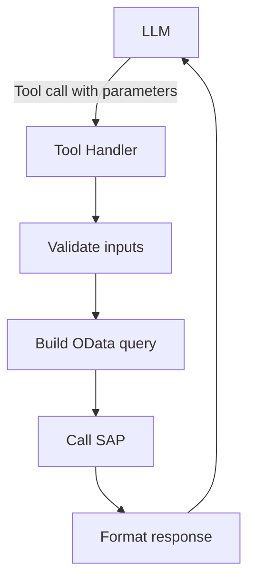

# Custom Tools

Beyond standard OData services, ABA supports custom MCP tools for organization-specific needs.

## When to Build Custom Tools

- Standard OData services don't cover a specific business process
- You need to combine multiple OData calls into a single operation
- Business logic or validation is required before calling SAP
- Integration with non-SAP systems alongside SAP data

---

## Tool Architecture

Every MCP tool follows a consistent structure:



Each tool has three parts:

1. **Definition** — what the LLM sees: name, description, input parameters (JSON Schema)
2. **Handler** — the business logic: input validation, OData query construction, SAP call, error handling
3. **Response formatter** — how the result is presented to the LLM (and ultimately to the user)

---

## Tool Definition (Schema)

The tool definition tells the LLM what the tool does and what parameters it accepts. This is critical — a good description leads to accurate tool selection by the AI.

```typescript
const getVendorBalance: ToolDefinition = {
  name: "get_vendor_balance",
  description:
    "Retrieve the current open balance for a vendor in a given company code. " +
    "Returns total open amount, number of open items, and currency. " +
    "Use this when the user asks about vendor balances, outstanding amounts, or open payables.",
  inputSchema: {
    type: "object",
    properties: {
      vendor_id: {
        type: "string",
        description: "SAP vendor number (e.g., '0000100045' or '100045')",
      },
      company_code: {
        type: "string",
        description: "SAP company code (e.g., '1000')",
      },
      key_date: {
        type: "string",
        description: "Balance key date in YYYY-MM-DD format. Defaults to today.",
      },
    },
    required: ["vendor_id", "company_code"],
  },
};
```

!!! tip "Description best practices"
    - Be specific about **what** the tool returns and **when** to use it
    - Include example values in parameter descriptions
    - List synonyms the user might use (e.g., "balance", "outstanding", "open payables")
    - Keep the description under 200 words — the LLM has limited context per tool

---

## Tool Handler (Implementation)

The handler receives validated parameters, builds the OData query, calls SAP, and returns formatted results.

```typescript
const handleGetVendorBalance: ToolHandler = async (params, context) => {
  const { vendor_id, company_code, key_date } = params;

  // Pad vendor number to 10 digits (SAP format)
  const paddedVendor = vendor_id.padStart(10, "0");

  // Default key date to today
  const effectiveDate = key_date || new Date().toISOString().split("T")[0];

  // Build OData query
  const query = `/sap/opu/odata/sap/API_BUSINESS_PARTNER/A_SupplierWithHoldingTax`
    + `?$filter=Supplier eq '${paddedVendor}'`
    + `&$select=Supplier,CompanyCode,BalanceInTransactionCurrency,Currency`;

  try {
    const response = await context.sap.get(query);

    if (!response.d.results || response.d.results.length === 0) {
      return {
        content: [
          {
            type: "text",
            text: `No open balance found for vendor ${paddedVendor} in company code ${company_code}.`,
          },
        ],
      };
    }

    const result = response.d.results[0];

    return {
      content: [
        {
          type: "text",
          text: [
            `Vendor: ${result.Supplier}`,
            `Company Code: ${result.CompanyCode}`,
            `Open Balance: ${result.BalanceInTransactionCurrency} ${result.Currency}`,
            `Key Date: ${effectiveDate}`,
          ].join("\n"),
        },
      ],
    };
  } catch (error) {
    return {
      content: [
        {
          type: "text",
          text: `Error querying vendor balance: ${error.message}`,
        },
      ],
      isError: true,
    };
  }
};
```

---

## Registering the Tool

Register your tool in the module's tool registry:

```typescript
// src/tools/fi/index.ts

import { getVendorBalance, handleGetVendorBalance } from "./get-vendor-balance";

export const fiTools: Tool[] = [
  // ... existing tools
  {
    definition: getVendorBalance,
    handler: handleGetVendorBalance,
  },
];
```

The MCP Server automatically picks up registered tools at startup. Verify by checking the `/health` endpoint — the tool count should increase.

---

## Testing a Custom Tool

### Unit test

```typescript
// src/tools/fi/__tests__/get-vendor-balance.test.ts

describe("get_vendor_balance", () => {
  it("should return balance for a valid vendor", async () => {
    const result = await handleGetVendorBalance(
      { vendor_id: "100045", company_code: "1000" },
      mockContext
    );

    expect(result.isError).toBeUndefined();
    expect(result.content[0].text).toContain("Open Balance");
  });

  it("should handle vendor not found", async () => {
    const result = await handleGetVendorBalance(
      { vendor_id: "999999", company_code: "1000" },
      mockContext
    );

    expect(result.content[0].text).toContain("No open balance found");
  });

  it("should pad vendor number to 10 digits", async () => {
    await handleGetVendorBalance(
      { vendor_id: "100045", company_code: "1000" },
      mockContext
    );

    expect(mockContext.sap.get).toHaveBeenCalledWith(
      expect.stringContaining("0000100045")
    );
  });
});
```

### Integration test (against SAP sandbox)

```bash
npm run test:tool -- get_vendor_balance --params '{"vendor_id":"100045","company_code":"1000"}'
```

### End-to-end test (with LLM)

```bash
npm run test:prompt -- "What is the open balance for vendor 100045 in company code 1000?"
```

Verify that:

1. The LLM selects `get_vendor_balance` (check logs)
2. The correct vendor and company code are passed
3. The response includes the balance and currency

---

## Examples of Custom Tools

| Tool | Description | Modules involved |
|------|-------------|-----------------|
| `custom_vendor_scorecard` | Combines delivery performance (MM), quality (QM), and payment history (FI) into a vendor scorecard | MM + QM + FI |
| `custom_order_health` | Checks a sales order against stock, credit, and production status in one call | SD + MM + FI |
| `custom_month_end_check` | Runs a series of FI checks for month-end closing readiness | FI + CO |
| `custom_plant_dashboard` | Aggregates maintenance (PM), production (PP), and inventory (MM) KPIs for a plant | PM + PP + MM |

!!! info "Development Support"
    The Avvale AI team can develop custom tools specific to your business processes. Contact us for a scoping session: **ai-team@avvale.com**
